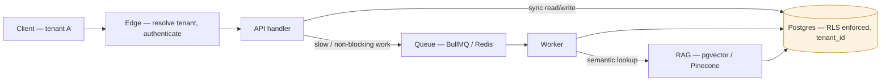

# Portfolio Content Blueprint — rameshwartiwari.vercel.app

**North star:** *"I build multi-tenant systems that hold up in production."*
Every page supports this line. Nothing repeats it verbatim — each page proves a different piece of it.

**One job per page.** This is the whole fix:
- **Home** — the 30-second pitch
- **Work** — the proof, in full
- **About** — the person and the career arc
- **Writing** — the authority
- **Contact** — the close

Nothing appears in full on two pages. If a block is duplicated today, it gets ONE canonical home below, and is cut everywhere else.

---

## 1. HOME

### 1.1 Hero
Keep as-is — it's the strongest thing on the site.
- Eyebrow: `Open to senior engineering roles`
- H1: *I build multi-tenant systems that hold up in production.*
- Subhead: tighten to one sentence — cut "AI-driven media verification platform end to end" from here; that's Vashix's job to say, not the hero's.
- Stat strip: `2+ years shipping production SaaS` · `5 modules in a live multi-tenant CRM` · `~40% faster after moving work to queues`
- CTA: `See the work` / `Resume`

### 1.2 Specialty pills — NEW, directly under the hero
Three tags, nothing more. This is the "sold in 2 seconds" layer that's currently missing — right now a recruiter has to read four case-study cards to reverse-engineer your focus. State it up front instead:

`Multi-Tenant Architecture` · `Async & Queue Systems` · `Applied AI / RAG`

Each pill can anchor-link down to the case study that proves it. This is also what turns "How I Think" from a nice diagram into a system — see §6.

### 1.3 How I Think
Keep, but this is where the single flagship diagram lives (§6). One diagram, not the current isolation-only one — expand it to show all three pills in one flow, so this section earns its place as *the* differentiator instead of a bonus.

### 1.4 Selected Work — trim from 4 cards to 2
Feature **Vashix** and the **Multi-Tenant CRM** — your two strongest signals for senior/staff-track roles (novel architecture + provable scale). Cut Courier Hub and Real-Time Task Platform from Home entirely; they still live in full on Work.
End the section with: `See all case studies →`

### 1.5 About teaser — NOT the full bio
Two lines + photo + link. Something like:
> *I'm a full-stack engineer in Mumbai. I spend most of my time on the parts of a product that are hard to change later — [Read more →]*

### 1.6 Latest Writing
1–2 posts max, not 3. Home is a sampler everywhere, not a mirror.

### 1.7 Closing CTA
Keep as-is.

### CUT FROM HOME ENTIRELY
- "Where I Have Worked" (roles timeline) → lives once, on About
- "What I Build With" (tools grid) → lives once, on Work (see §4)

Net effect: Home goes from ~14 sections to ~7. It becomes something a stranger can read in 45 seconds and want more — not something that already told them everything.

---

## 2. WORK

Rename the H1 from "Case studies" to just **"Work"** — matches the nav, and avoids sounding like agency-speak when the projects underneath are a mix of employer work and a personal build.

### 2.1 Case study card template (index page)
Keep your current card format — overline role + dates, name, one-paragraph problem framing, tag chips, 3 stat pills, "Read case study." It's genuinely good. Order by relevance to the roles you want, not chronology (Vashix → CRM → Courier Hub → Real-Time Platform is already correct).

### 2.2 Individual case study page structure (the page behind "Read case study")
This is where hiring decisions actually get made, so give each one the same four-beat arc:

1. **Context** — who this was for, what existed before, what was actually broken
2. **Constraint** — the thing that made it hard: timeline, conflicting carrier APIs, "isolation must be structural not conventional," etc.
3. **Approach** — the 2–3 decisions you made and *why*, not a feature list. This is where the architecture diagrams belong (one per case study, not just the homepage one)
4. **Result** — the stat, and one line on what it unlocked (not just the number)

Apply this to all four:
- **Vashix** — context: photos/video are now trivially faked; constraint: proof has to be defensible, not just plausible; approach: on-device signing at capture + C2PA 2.1 + a trust-scoring engine; result: 0→100 trust score, multi-tenant from day one
- **Multi-Tenant CRM** — context: empty repo → 5 modules across enterprise accounts; constraint: cross-tenant leakage had to be *impossible*, not merely policed; approach: RLS at the Postgres layer, tenant_id enforced below the app; result: 5 modules, ~40% faster after queueing, multi-account
- **Courier Hub** — context: carrier APIs agree on almost nothing; constraint: one domain model has to survive every carrier's version of the truth; approach: unified integration layer, idempotent operations; result: multi-carrier, retry-safe, built-in reporting
- **Real-Time Task Platform** — context: real-time collab; constraint: not "how do I push updates" but "what happens when two updates disagree"; approach: Socket.io + RBAC; result: real-time multi-user sync, scoped permissions

### 2.3 Tools & Technologies — single canonical home, HERE not About
Move the full tech-stack grid to the bottom of Work, reframed as evidence, not decoration:
> *"Everything below shipped in one of the four systems above — filter case studies by tool if you're scanning for a specific stack."*
See §7 for the full categorized list. (If your build supports it, make each chip a filter for the case study cards above it — turns a static list into a second way to browse Work.)

---

## 3. ABOUT

This page's only job is: *who is this person, and what's their arc.* Cut anything that's really "proof" (that belongs on Work) or "pitch" (that belongs on Home).

Keep, in this order:
1. **Bio** — current opening paragraph, unchanged, it's good
2. **How I Work** — the fuller philosophy (schema design, tenancy, queue boundaries, failure modes) — this is the deep-dive version of the Home "How I Think" teaser
3. **What I'm Doing Now** — Vashix + AWS SA study — see the framing note below
4. **AI, Specifically** — keep, it's a strong paragraph and does real work distinguishing "shipped RAG" from "read about RAG"
5. **Before This** — education, 9.0 CGPA, internships
6. **Outside the Editor** — keep, it's the one moment of personality on the whole site, don't cut it
7. **Roles** — the career timeline — single canonical home, moved here from Home
8. **Education & Certifications** — stays here

### Framing note on Vashix (worth one deliberate sentence)
You're running Vashix in parallel with a full-time role at AdsCult while the hero says "open to senior roles." That's a genuine plus — initiative, ownership — but left unstated it can read as ambiguous (founder-track? IP conflict? availability?). One line fixes it, e.g.: *"I build this outside working hours — it's the thing that keeps my AWS and AI work sharp between paid projects."* Say it once, on About where the narrative lives, not on Home where it would slow the pitch down.

### CUT FROM ABOUT
- The Tools & Technologies grid — moved to Work (§2.3), single home there instead of duplicated here

---

## 4. WRITING

No structural changes — this page already has one clear job and does it. Keep the tag filters, keep the RSS link. If anything, this is your most "senior engineer" page as-is: three sharp, opinionated posts with real tags (PostgreSQL, BullMQ, RAG) is exactly the "documentation separates junior from senior portfolios" signal hiring managers look for. Write more of these before you touch anything else on the site.

---

## 5. CONTACT

Keep minimal. One line, one CTA, direct email + socials. Don't add content here — this page's only job is to be frictionless, not persuasive.

---

## 6. THE ONE DIAGRAM — "How I Build Systems"

Your current diagram (isolation/RLS only) is good but proves one pill out of three. Upgrade it into a single unified diagram that shows all three specialties in one request path — this becomes the most-shared, most-memorable asset on the site, because nobody else's portfolio has "here is the shape of every system I build."

**What it shows:** one request entering the system, splitting into a synchronous path (served immediately) and an asynchronous path (queued), with tenant isolation enforced at the database boundary for both — and the AI/RAG layer shown as a service the async path calls into, not a separate diagram bolted on.

**Legend / caption (use as the section's supporting copy):**
> Every request resolves a tenant at the edge. Fast work is served synchronously; slow work goes on a queue instead of blocking the response. Either way, no query reaches Postgres without passing the same enforced boundary — a forgotten `WHERE` clause stops being a breach, and a forgotten queue check stops being a timeout. AI retrieval is just another worker calling into that same boundary, not a separate system with separate rules.

This single diagram is what your specialty pills (§1.2) point down to, and each case study's own diagram (§2.2) becomes a *close-up* of one part of this one — so the whole site reads as one coherent architecture instead of four unrelated projects.

---

## 7. FULL TECH STACK — categorized, single home on Work (§2.3)

**Core Stack** — the everyday stack, TypeScript end to end
`TypeScript` `JavaScript (ES6+)` `React` `Next.js` `Node.js` `Express.js` `Prisma ORM` `REST APIs` `SQL`

**AI & GenAI** — shipped in production, not notebook demos
`RAG (production)` `Pinecone` `pgvector` `LLM APIs` `Claude Code` `Prompt engineering` `Chunking / retrieval evaluation`

**Cloud & DevOps** — the AWS footprint you actually operate
`AWS EC2` `AWS RDS` `AWS S3` `AWS SQS` `AWS Amplify` `Nginx (reverse proxy)` `CI/CD`

**Architecture & Data** — the decisions that are expensive to reverse
`PostgreSQL` `MySQL` `Redis` `BullMQ` `Socket.io` `MongoDB` `JWT` `Row-Level Security` `Multi-tenancy` `C2PA 2.1` `Android SDK`

Keep chips exactly this granular — specific enough to be a search/filter surface (recruiters and ATS tools scan for exact terms like "pgvector" or "Row-Level Security"), vague enough categories to still read as a system, not a keyword dump.

---

## Summary of what moves where

| Block | Was on | Now lives on (once) |
|---|---|---|
| Roles / career timeline | Home + About | About only |
| Tools & technologies grid | Home + About | Work only |
| Full 4 case studies | Home + Work | Work only (Home shows 2 + link) |
| Specialty framing | Implicit in tags only | Explicit pills on Home |
| Unified architecture diagram | Isolation-only, Home | Expanded 3-pillar version, Home §1.3 |